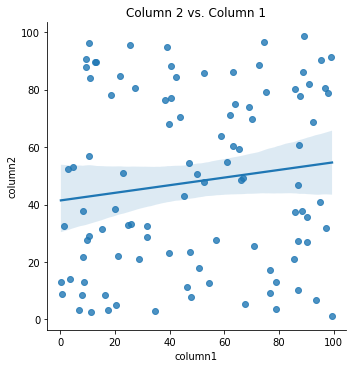

# Supplemental Code: Example

The code and data in this repository is an example of a reproducible research workflow for MACS 30200 "Perspectives on Computational Research" at the University of Chicago.

The code is written in Python 3.9.7 and all of its dependencies can be installed by running the following in the terminal (with the `requirements.txt` file included in this repository):

```
pip install -r requirements.txt
```

Then, you can import the `analysis` module located in this repository to reproduce the analysis in the (hypothetical) publication that this code supplements (in a Jupyter Notebook, like README.ipynb in this repository, or in any other Python script):


```python
import analysis
```

You can then use the `process_data` function in the `analysis` module to process the data and get it ready to analyze. The `plot` function will reproduce Figure 1 from the (hypothetical) publication.


```python
df = analysis.process_data('data.csv')
analysis.plot(df)
```





Alternatively, to replicate the analysis and produce all of the figures and quantitative analyses from the (hypothetical) publication that this code supplements, build and run the `Dockerfile` included in this repository via the instructions in the file).

If you use this repository for a scientific publication, we would appreciate it if you cited the [Zenodo DOI]() (see the "Cite as" section on our Zenodo page for more details).
